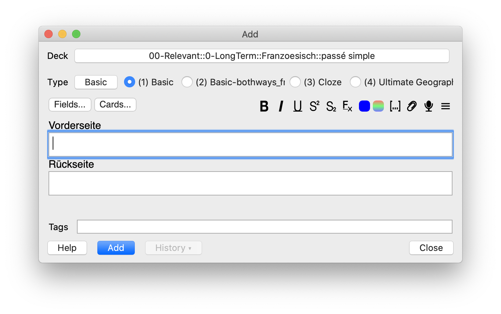

# Anki Quicktype

> Allows you to use cmd+1, cmd+2, etc. to select card types. Super fast!

Bootstrapped from [Arthur-Milchior/anki-keep-model-in-add-cards](https://github.com/Arthur-Milchior/anki-keep-model-in-add-cards) and original Anki codebase.

As such: GNU AGPL, version 3 or later; http://www.gnu.org/licenses/agpl.html
